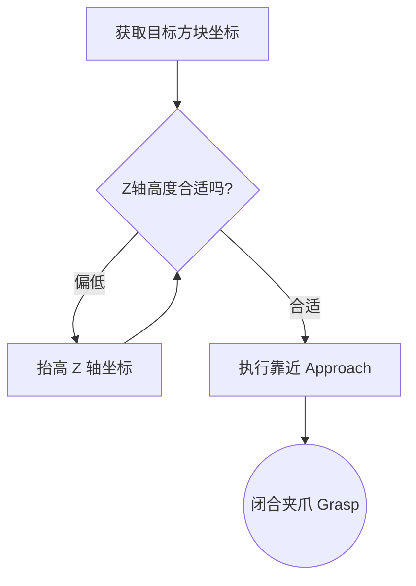
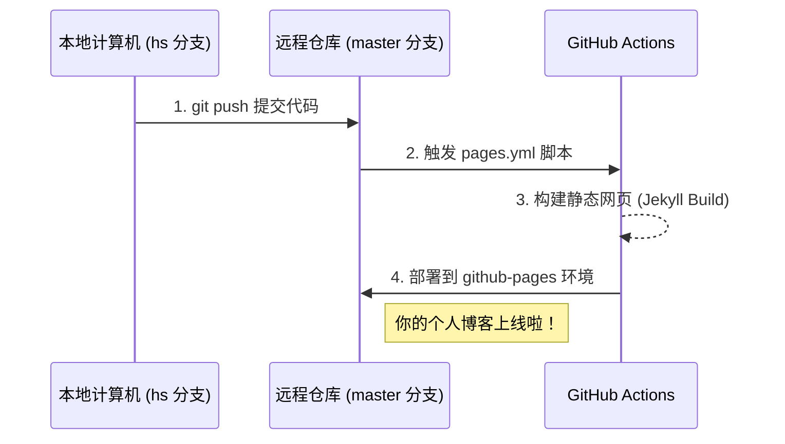

根据[官方模板文档](https://chirpy.cotes.page/posts/write-a-new-post/#table-of-contents) 得来
# Hello hello
你好
## Hello hello
你好好
### Hello hello
你好好好٩(•̤̀ᵕ•̤́๑)ᵒᵏᵎᵎᵎᵎ

# Hello World
{: w="700" h="400" .light}
{: w="700" h="400" .dark}

## Program
{: .shadow}

# Vedio


> 接天莲叶无穷碧，映日荷花别样红。
{: .prompt-info }

> 我方水晶正在被攻击
{: .prompt-warning }

> You have lost.
{: .prompt-danger }


`huggingface_cli download --resume-download --repo-type dataset lerobot/piper-collect `

```python
from huggingface_hub import snapshot_download

snapshot_download{
  repo_id="lerobot/piper-collect",
  repo_type=dataset,
  local_dir=".",
  resume_download=true,
  endpoint="https://hf-mirror.com"
}
```
{: file="./dowload.py"}

```python
from huggingface_hub import snapshot_download

snapshot_download{
  repo_id="lerobot/piper-collect",
  repo_type=dataset,
  local_dir=".",
  resume_download=true,
  endpoint="https://hf-mirror.com"
}
```
{: .nolineno}

`/home/hs/lerobot/outputs/train/gr00t/checkpoint`{: .filepath}

### Liquid

```liquid

  This product's title contains the word Pack.

```


# Math
## 独立公式块

$$
E = mc^2
$$

## 带编号的行内公式并在正文引用
$$\begin{equation}
  F = ma
  \label{eq:newton}
\end{equation}$$
正如我们在公式 \eqref{eq:newton} 中看到的

## 行内公式
我们知道变量 $$x$$ 和变量 $$y$$ 成正比。

## 列表行内公式
1. 这是第一步计算 \$$a^2 + b^2 = c^2$$
2. 这是第二步计算 \$$\sin(\theta)$$

# Mermaid
## 基础流程图

## 时序图

